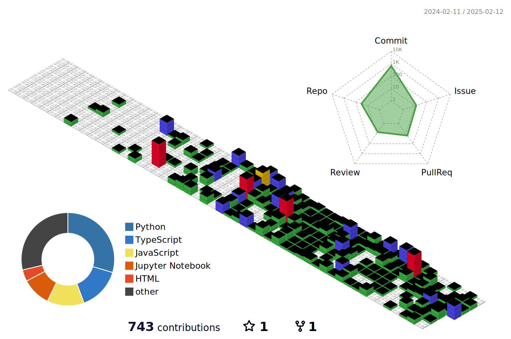

  
  ### Hello, I'm Jeonghyeok Lee! 👋
  <b> I'm studying backend and my hobby is chess</b>
   
   
  
  
    
    
    
    
  

  

    
    
    
  

 

 
 
## 📦 Projects
- 🚀 RSS기반 AI 정보 어시스턴트 앱 [🔗](https://github.com/Team-Found/SANDDEOT-App)
- 🧸 discord.py를 활용한 십이장기봇 [🔗](https://github.com/GAMZAMANDU/12chessBot)
- 🧸 discord.py를 활용한 턴제카드 게임봇 [🔗](https://github.com/GAMZAMANDU/DeathCard)
- 🧸 관광데이터를 활용한 지역명소 포토헌트 앱 [🔗](https://github.com/FindOut-Hackathon)
 

## ☎️ Contact Me
- **Email:** [galbimandu1126@gmail.com](mailto:galbimandu1126@gmail.com)
