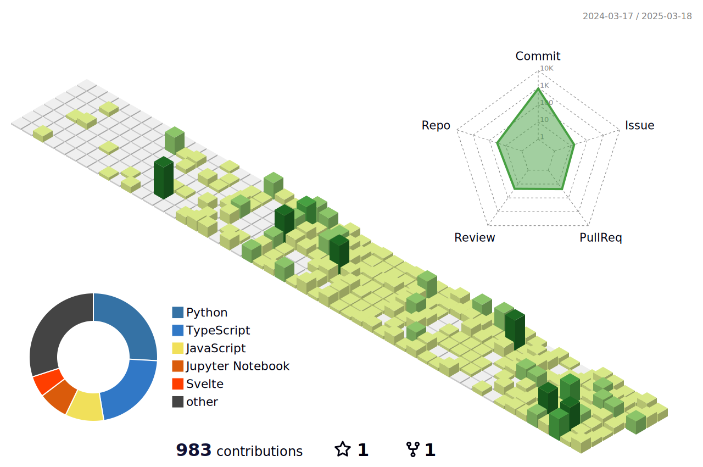

# Hi there, I'm Jeonghyeok Lee! 👋

## About Me

- 🎓 Currently a student at **Busan Software Meister High School**.
- 🌱 learning the **Next.js, Go**
- 💻 Passionate about coding and continuously improving my skills.

## Skills

**Languages**
  

**Frameworks**
  

**Sever**

**Learing** 
-Mocha

**Tools**
  

**Design**
  

## Projects
- discord.py를 활용한 십이장기봇 ([바로가기](https://github.com/GAMZAMANDU/12chessBot))
- discord.py를 활용한 게임봇 ([바로가기](https://github.com/GAMZAMANDU/DeathCard))
- AI 추천 RSS로 정보 습득이 쉬워지는 순간! ([바로가기](https://github.com/Team-Found/SANDDEOT-App))
- 관광에 재미를 더하다 ([바로가기](https://github.com/FindOut-Hackathon))
## Contact Me

- **Email:** [galbimandu1126@gmail.com](mailto:galbimandu1126@gmail.com)

## GitHub Stats

## Backjun

